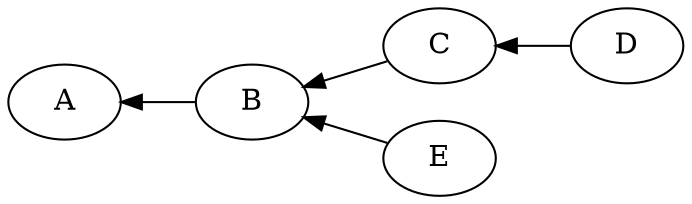
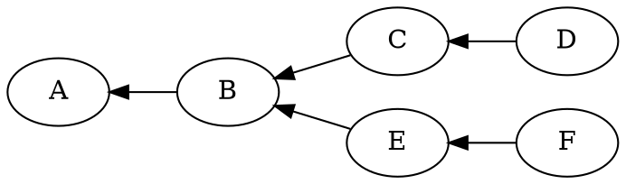

import {HeaderBadgesWidget} from '@site/src/components/HeaderBadgesWidget.js';

<HeaderBadgesWidget commaDelimitedContributors="Potuz" />

:::info

This content was previously [published on HackMD](https://hackmd.io/5NhsX8FvSm2GqESpdpe-Vg?view). The version you're reading now is the version that we're maintaining.

:::

In this document we cover optimistic sync and its detailed implementation in Prysm. We explain the numerous subtle edge cases that arise because of it and the mitigation factors to some attacks that arise when several nodes are optimistic. We start with a high level introduction to what optimistic sync is and how it is specified, and then move to the specific details within Prysm's implementation. 

We describe Prysm's API to deal with optimistic sync, describing what the involved functions do, but not **how they do it**. For example, we describe that [SetOptimisticToInvalid](https://github.com/prysmaticlabs/prysm/blob/develop/beacon-chain/forkchoice/doubly-linked-tree/optimistic_sync.go#L10) prunes invalid nodes from the forkchoice tree, but do not explain how this pruning is achieved. 

## 1 What is optimistic sync?

Simply put, optimistic sync allows a consensus layer client (CLC) to import, process, and consider a beacon block for its forkchoice head, even though it has not validated its execution payload. Thus, syncing this block *optimistically* hoping that the block will be eventually validated by the execution layer client (ELC). 

Optimistic sync was devised because of the different mechanisms utilized by the CLC and the ELC to sync. Most ELC use a syncing mechanism called *snap sync* by which they download a snapshot of the current state from their P2P network, and then proceed to download backwards the blocks and transactions filling its history. Since after the merge, the CLC drives the ELC, without a mechanism to allow the execution layer to sync independently from the consensus layer, it would never catch up to head. The most obvious alternative, known as *lockstep syncing* consists of starting with a synced state, and importing one block at a time, importing first from the consensus layer and passing down the execution payload to the execution layer. Current sync block times show that syncing a small network like Kiln would take over a couple of weeks in lockstep mode on a decent server. There is a more sensible alternative to optimistic sync using the *Light client protocol* which we will not cover in this document.  

### The happy case
From the user's perspective, the overwhelming majority of nodes that are  optimistically syncing are nodes that have just been started. The CLC can use checkpoint sync and be in sync in under 2 minutes. Snapshot sync for the ELC on the other hand will take much longer. Until the ELC catches up on head, the CLC may continue to import and keep syncing the beaconchain in optimistic mode. There are few edge cases in this situation. All edge cases and subtle considerations happen when an otherwise synced node, falls into optimistic sync due to an unforeseen circumstance. 

## 2 Specification

### 2.1 Which blocks can be imported optimistically?

The specification of optimistic sync is fairly simple. A node makes the following validations on a beacon block to decide if it can be imported or not into its forkchoice/database. If the block fails consensus validation (signature, operations, right proposer, etc, but excluding execution payload validation), then reject the block and do not import it. Assuming that we have a beacon block that passes this validation. The following blocks are allowed to be imported:

- If the block is pre-merge (ie. it does not include an execution payload). 
- If the parent of the block is post-merge (ie. it does include an execution payload).

This leaves only a merge block itself unaccounted for, that is a block which does include an execution payload, but it is the **first** block in the chain to do so. In this case an extra rule is applied:

- If the block's slot is old enough, it is allowed to be imported. Here *old enough* means that the block slot is lower than the current wall time slot by at least `SAFE_SLOTS_TO_IMPORT_OPTIMISTICALLY` which in the current spec defaults to 128 slots. 

This last rule, which is the only rule from the consensus layer side preventing a node from importing a block, is to mitigate an attack known as the *forkchoice poisoning attack* which we will cover below in section [2.4](#24-forkchoice-poisoning).

### 2.2 The engine API

When the CLC receives a block with an embedded execution payload, it notifies the ELC via two different engine API RPC calls: [engine_newPayloadv1](https://github.com/ethereum/execution-apis/blob/main/src/engine/specification.md#engine_newpayloadv1) and [engine_forkchoiceUpdateV1](https://github.com/ethereum/execution-apis/blob/main/src/engine/specification.md#engine_forkchoiceupdatedv1). These are wrapped internally within Prysm in the blockchain's package methods [notifyNewPayload](https://github.com/prysmaticlabs/prysm/blob/develop/beacon-chain/blockchain/execution_engine.go#L160) and [notifyForkchoiceUpdate](https://github.com/prysmaticlabs/prysm/blob/develop/beacon-chain/blockchain/execution_engine.go#L36). These functions are used in different stages of block processing and have different semantics for the ELC. We call `notifyNewPayload` to inform the ELC that this payload is available and request its validation. We call `notifyForkchoceUpdate` to inform the ELC that our head has changed and that it should react accordingly (changing the current execution state, the list of canonical blocks, etc). 

When Prysm receives a block, after the pubsub validation, and assuming regular sync, it enters the blockchain package via the function [ReceiveBlock](https://github.com/prysmaticlabs/prysm/blob/develop/beacon-chain/blockchain/receive_block.go#L38) and eventually [onBlock](https://github.com/prysmaticlabs/prysm/blob/develop/beacon-chain/blockchain/process_block.go#L96) is called. At this stage, the consensus aspects of this block have been verified. We call `notifyNewPayload` and await the return of the ELC. There are five possible outcomes of this call:

 1. VALID
 2. INVALID
 3. ACCEPTED/SYNCING
 4. Timeout (the ELC has not replied)
 5. Error (something went wrong in the call)

Dealing with each one of them requires a different set of careful considerations, roughly ordered by level of difficulty. When we receive `VALID` as a reply, we can simply import the block, this block is not optimistic as it has been fully validated. 

When we receive `INVALID` a series of checks need to be carried out, we will go over them in the following sections of this document. It suffices to say that for a non-optimistic node (ie. a node that has been syncing in lockstep) when it receives an `INVALID` response from this call, its processing is very simple: we just do not import this block, it has failed validation, we mark the block as invalid and `onBlock` (and subsequently [ReceiveBlock](https://github.com/prysmaticlabs/prysm/blob/develop/beacon-chain/blockchain/receive_block.go#L380)) will return with an error, without affecting core logic. What triggers optimistic sync is the response in 3) ACCEPTED/SYNCING. Both replies are treated in the exact same way by Prysm, but it is useful to understand the different semantics from the point of view of the ELC. Suppose we are following a chain that is following like this:


<!-- 

-->


Our head is `D`, and the ELC has returned `VALID`  for it when we called
`notifyForkchoiceUpdated`  to inform that our head had changed to `D`. We now receive a block in a side chain, orphaning `D` and `C`:


<!-- 

-->


Regardless of what happened to our forkchoice, as we first call `notifyNewPayload`  before making any head considerations, our head will still be `D`  at the moment of calling `notifyNewPayload`. Different ELC will return different replies here. They are not required to execute and validate the block `F` as it does not extend their canonical chain. Some will do anyway, and thus can return VALID / INVALID if they executed the payload completely. Others will simply check that the timestamps, parent block hash and similar header numbers are consistent and will return ACCEPTED, indicating that the block `F` is ready to be executed but hasn't been fully validated yet. Another option is if the ELC does not have the execution payload of the block `E`  for some reason. In this case the ELC will return SYNCING and it may or may not trigger a request for this block. Either way, a reply of ACCEPTED or SYNCING means that there is nothing evidently wrong with the block, that we may go ahead and import it optimistically, and we will eventually validate it if it is necessary. 

If the block `F` is therefore ACCEPTED or SYNCING, we will run the checks in section [2.1](#21-which-blocks-can-be-imported-optimistically) and import it if it satisfies those conditions. 

### 2.3 Optimistic Node

It may happen that after importing this block `F` it becomes head. In this case we will inform the ELC by calling `notifyForkchoiceUpdated`. The engine is now **required** to execute and validate block `F` if it hasn't done so already. Some engines (eg geth) would have already validated the block if the fork was not long enough. In this case they will return immediately VALID / INVALID. Other engines may not have executed it, specifically, if they haven't executed even block `E`, or if they do not even have block `E`, they will return SYNCING. In this case, the CLC has already imported the block `F`, which is now its current head, and it has been imported optimistically. When this happens we say that **the node is optimistic**. 

<mark>An optimistic node may not act on its head: it cannot propose a block, it cannot attest to an optimistic head and cannot sign sync committee duties.</mark> It may (and should) however gossip optimistic blocks.

### 2.4 Forkchoice Poisoning

We mentioned above a subtle condition preventing a node from optimistically syncing the merge block. This attack happens as follows. Suppose we have a forkchoice situation like the following diagram:


An attacker is able to propose a block `A` which satisfies:

- It is the merge block
- It's parent execution block is invalid or non-existent
- It justifies a new checkpoint in the beacon-chain

A node that is optimistically syncing the beacon chain in this conditions will not be able to follow any other chain until the network justifies a higher checkpoint. The reason is the way we decide our head in the forkchoice package: we choose among the tips of the forkchoice tree, those that have the higher justification first. For more details on this procedure you can look at the slides in [this video](https://drive.google.com/file/d/1aiUIVjPEGUv9iNESHaSfFN4DfLgba8al/view?usp=sharing).  Any other block imported in a separate branch will not be considered for head unless it also justifies a higher point. An honest validator following this invalid chain will not be able to leave optimistic mode unless the chain justifies a higher point: it can't fully sync since the ELC cannot find the parent of the merge block, and it can't jump head because it can't choose a lower justification point. 

With the assumption that the majority of the chain will justify a checkpoint after the merge in less than `SAFE_SLOTS_TO_IMPORT_OPTIMISTICALLY`, then it is safe to import optimistically the merge block, knowing that at least this many slots have passed and we will have an honest justified checkpoint available to jump, in case this merge block is not valid. 

## 3 Implementation in Prysm

Prysm's implementation of optimistic sync involves several different packages. It principally touches the forkchoice and blockchain packages as it changes the core handling of beacon blocks. But it also touches the database (package kv) and the sync package (during init sync and pubsub validation) and the RPC endpoints.  In this section we will cover all the paths added in each package. 

### 3.1 Forkchoice package

The forkchoice package keeps track of the optimistic status of each node. This is required as an optimistic node cannot perform its duties. When inserting a node, it is by default considered optimistic. Its status can be changed to fully validated with the function [SetOptimisticToValid](https://github.com/prysmaticlabs/prysm/blob/develop/beacon-chain/forkchoice/doubly-linked-tree/forkchoice.go#L378):

```go
func (f *ForkChoice) SetOptimisticToValid(ctx context.Context, root [fieldparams.RootLength]byte) error
```

This function simply takes the HTR of the block and it sets its optimistic status to VALID. It also sets the optimistic status of any ancestor to VALID since a block cannot be fully validated if its ancestors weren't. 

If a block that was imported optimistically later becomes INVALID, this can be notified with the function [SetOptimisticToInvalid](https://github.com/prysmaticlabs/prysm/blob/develop/beacon-chain/forkchoice/doubly-linked-tree/optimistic_sync.go#L10):

```go
func (s *Store) setOptimisticToInvalid(ctx context.Context, root, parentRoot, payloadHash [32]byte) ([][32]byte, error)
```

The reader will notice that the signature of this function is different. The reason is that when the ELC returns INVALID from `notifyNewPayload` , it also returns the latest valid hash (LVH), that is, the payload hash of the unique execution block that satisfies the following two conditions:

- It is a VALID ancestor of the INVALID payload
- Any ancestor of the INVALID payload, with a higher `blockNumber`, is INVALID

The INVALID payload itself may or may not be in the forkchoice store, in fact, it will **almost never** be, since we only call `notifyNewPayload` with new blocks before we insert them to forkchoice. The function `setOptimisticToInvalid` takes as parameters the root of the INVALID block, the root of its parent block, and the LVH. It works by first finding the unique block satisfying the following conditions:

- It is a child of the LVH
- It is an ancestor of the INVALID payload

And then it removes that block and **every descentant** of it. This is strictly true in the `doubly-linked-tree`  implementation of forkchoice. But this is not the case in the `protoarray` implementation. Removing nodes from the `protoarray` implementation is complicated. Thus what we do in this case is mark the nodes as INVALID instead. After removal of the nodes, the weights of the remaining forkchoice tree needs to be readjusted. The function returns the blockroots of all the removed nodes (or those nodes marked as invalid in the `protoarray` implementation).

The `doublylinkedtree.Node` structure has a boolean `optimistic`:

```go
type Node struct {
	slot                     types.Slot                   // slot of the block converted to the node.
        ...
	optimistic               bool                         // whether the block has been fully validated or not
}
```

That is `true` (default) when the node is optimistic, and false if it has been fully validated. 

The `protoarray.Node` structure instead has to keep track of invalid nodes as well:

```go
type Node struct {
	slot                     types.Slot                   // slot of the block converted to the node.
        ...
	status                   status                       // optimistic status of this node
}
// enum used as optimistic status of a node
type status uint8
const (
	syncing status = iota // the node is optimistic
	valid                 // fully validated node
	invalid               // invalid execution payload
)
```

<mark>Besides tracking their optimistic status, an optimistic forkchoice node does not have any difference with fully validated nodes. They count for justification/finalization and head computations just like a fully validated node.</mark>

Finally, forkchoice returns the optimistic status of a blockroot via the exposed self-described function:

```go
	IsOptimistic(root [32]byte) (bool, error)
```

### Blockchain package
We have already described at a high level the changes in the blockchain package in the previous section. The main function during block processing in regular sync is the function [onBlock](https://github.com/prysmaticlabs/prysm/blob/develop/beacon-chain/blockchain/process_block.go#L96). This function executes the state transition and calls the execution engine via `notifyNewPayload`.

#### 3.2.1 `notifyNewPayload`

 Since the block hasn't been inserted to forkchoice yet, it records the return of this function. Recall that a block is inserted optimistically to forkchoice by default. If `notifyNewPayload` has returned VALID, then we call `SetOptimiticToValid` right after inserting the block to forkchoice. 

The return type of `notifyNewPayload` is 
```go
func (s *Service) notifyNewPayload(...) (bool, error)
```
it returns `true` when the payload has been fully validated and is VALID. It returns `false, nil` when the payload has not been fully validated and the block can be optimistically synced (that is, the engine has returned ACCEPTED / SYNCING and the block passes the checks in section [2.1](#21-which-blocks-can-be-imported-optimistically).

The function returns an error if either the block was deemed INVALID or an unhandled execution engine error was returned. 

If the return from the execution engine is INVALID, within `notifyNewPayload` we call the blockchain function `SetOptimisticToInvalid` described above, to obtain the list of blockroots that have been previously imported optimistically and we now know were in fact INVALID. These blocks, and their corresponding state summaries and states have been imported to our database. We call [removeInvalidBlockAndState](https://github.com/prysmaticlabs/prysm/blob/0ed5007d2e51874f158d4bc8dbd632b1b547b3d7/beacon-chain/blockchain/execution_engine.go#L305) from the `blockchain` package. This function simply takes the list of invalid roots and removes the corresponding blocks from the database and the states from the state cache. 

#### 3.2.2 `notifyForkchoiceUpdate`

The other situation where we have to deal with optimistic status during `onBlock` is when we call `notifyForkchoiceUpdate`, this function is called from `onBlock` by calling first [notifyEngineIfChangedHead](https://github.com/prysmaticlabs/prysm/blob/develop/beacon-chain/blockchain/receive_attestation.go#L174). 

`notifyForkchoiceUpdate` has a more complicated logic in regard to optimistic status. If the response from the ELC is VALID, then it informs forkchoice via `SetOptimisticToValid` (recall the block has been already inserted to forkchoice if its to become head). If it is SYNCING then it returns without doing anything. The reason for this is that the default for a forkchoice node is to be optimistic, and a transition VALID -> SYNCING would be a bug in the ELC. 

The complicated case is when the result is INVALID. In this case the function `notifyForkchoiceUpdate` will call `SetOptimisticToInvalid` on the INVALID root, then  prune the blocks with `removeInvalidBlocksAndState` with the resulting blockroots. Finally it needs to obtain the new Head from forkchoice and call `notifyForkchoiceUpdate` again, and this process is recursive since we may reorg into another branch that was itself optimistic and containing INVALID blocks again. This procedure will remove all INVALID branches from the forkchoice tree and then return with an error marking the last imported block as invalid. 

#### 3.2.3 Attestation processing

Another path that triggers a call to `notifyForkchoiceUpdate`, although not strictly speaking involved with optimistic sync is when processing attestation. Prysm runs the following on every slot with a time ticker:

```go
st := slots.NewSlotTicker(s.genesisTime, params.BeaconConfig().SecondsPerSlot)
        for {
                select {
                case <-s.ctx.Done():
                        return
                case <-st.C():
                        if err := s.ForkChoicer().NewSlot(s.ctx, s.CurrentSlot()); err != nil {
                                log.WithError(err).Error("Could not process new slot")
                                return
                        }

                        if err := s.UpdateHead(s.ctx); err != nil {
                                log.WithError(err).Error("Could not process attestations and update head")
                                return
                        }
                }
        }
```

It is important to keep this path in mind when considering forkchoice changes, the function `NewSlot` updates the justification and finalization of forkchoice when called at the beginning of an epoch. The function `UpdateHead` will process attestations and then update head if necessary, calling `notifyForkchoiceUpdate` in the process if the head as been updated due to new attestations. 

#### 3.2.4 Init sync

The path for init sync is very similar to sections [3.2.1](#321-notifynewpayload) and [3.2.2](#322-notifyforkchoiceupdate). The main block processing function during init sync is the function [onBlockBatch](https://github.com/prysmaticlabs/prysm/blob/develop/beacon-chain/blockchain/process_block.go#L282). This function does essentially the same processing as `onBlock` but it takes consecutive batches of blocks to do signature verification by aggregation. In what regards to optimistic syncing the behavior is the same as in regular sync: for each block a call to  `notifyNewPayload` is made. However only after the full batch has been processed and verified, it is inserted in forkchoice. Only the last block inserted is considered for optimistic sync, namely if this block is VALID, then the whole batch is considered VALID, otherwise the whole batch is considered optimistic. Since the batch is linear, we only call `notifyForkchoiceUpdate` in the last block of the batch. 

### 3.3 (g)RPC API

A CLC is required to respond to requests for blocks, state information, head information, etc. The node is required to provide optimistic status information in its reply. Many of the endpoints simply add a JSON field `is_optimistic` that results `true` when the corresponding block has been inserted optimistically or `false` when it has been fully validated. The beacon node ultimately calls the two functions [IsOptimistic](https://github.com/prysmaticlabs/prysm/blob/develop/beacon-chain/blockchain/chain_info.go#L301) and [IsOptimisticForRoot](https://github.com/prysmaticlabs/prysm/blob/develop/beacon-chain/blockchain/chain_info.go#L322).

The former is just a wrapper around the latter, it fetches the head root of the node and calls the latter. The latter returns whether the block with the given root is optimistic. It does so by calling first forkchoice's `IsOptimistic` and if it fails it checks with the database as explained in the next section.

Perhaps the most important impact that optmistic sync has on the API section, is that when the validator calls `GetBlock` to obtain a new block to propose, or when it calls `GetAttestationData` to obtain an attestation and so forth, for each of the validator duties, the corresponding RPC calls include a call to check the optimistic status of the node as follows:

```go
// An optimistic validator MUST NOT participate in attestation. (i.e., sign across the DOMAIN_BEACON_ATTESTER, DOMAIN_SELECTION_PROOF or DOMAIN_AGGREGATE_AND_PROOF domains).
if err := vs.optimisticStatus(ctx); err != nil {
      return nil, err
}
```

It is important, and dangerous to not act in optimistic node. From a network perspective because it may lead to finalization/justification of an invalid chain. And from a selfish perspective because it may lead to slashing eventually when we slash validators for attesting on invalid payloads. 

### 3.4 Database

We have described in section [3.1](#31-forkchoice-package) that the forkchoice package is responsible for tracking the optimistic status of imported nodes. Forkchoice however prunes nodes after finalization and we can finalize during optimistic mode. If we require optimistic information about an ancient block we request this information from the database. The database tracks the last *validated checkpoint*. This is a checkpoint by which any canonical block older than it is considered VALID, and any block that is not in forkchoice and that is newer than the last validated checkpoint, is optimistic. The function to obtain this information is [LastValidatedCheckpoint](https://github.com/prysmaticlabs/prysm/blob/develop/beacon-chain/db/kv/validated_checkpoint.go#L13). 

Notice that any orphaned block in the database, even those older than the last validated checkpoint, will be served as  optimistic, even though they may have been fully validated. This is a compromise to avoid complicated setups as we [previously had designed](https://www.notion.so/prysmaticlabs/Optimistic-blocks-storage-05d0832243ce46b4bd36e422e8f8e15f#85e6baf047eb4d16b9d0fc2ca6ad8569). 

The last validated checkpoint is updated only when we finalize a new checkpoint and thus its pruned from forkchoice. The corresponding function is [SaveLastValidatedCheckpoint](https://github.com/prysmaticlabs/prysm/blob/develop/beacon-chain/db/kv/validated_checkpoint.go#L32) and is called from [updateFinalized](https://github.com/prysmaticlabs/prysm/blob/develop/beacon-chain/blockchain/process_block_helpers.go#L139). This latter function is called both from `onBlock` and `onBlockBatch` when processing a block in regular or init sync that updates finalization. 

## 4 Some edge cases and unsolved problems

### 4.1 Justification reversal after pruning
Most of the edge cases with optimistic sync happen in the presence of invalid payload. We have already described the situation with [Forkchoice Poisoning](#forkchoice-poisoning). The following similar situations have been described in the open issues [10782](https://github.com/prysmaticlabs/prysm/issues/10782) and [10777](https://github.com/prysmaticlabs/prysm/issues/107770). They are variations of the same phenomenon: an INVALID chain is imported and it updates justification, even though the justification checkpoint is VALID, the node may be deadlocked. 

Consider the following diagram:


At the beginning of Epoch 10 the justified epoch is 9, the justified checkpoint is pointed by block `A`. The epoch advances fine but the ELC is still syncing, therefore this node is taking blocks optimistically. Block `C`  in epoch 10 may have or may not have enough attestations to justify Epoch 10, but its own post-state justification checkpoint is still block `A` in Epoch 9, as justification is updated only on epoch processing.  Block `D` is the first block imported in epoch 11 and it is the first one to justify block B in epoch 10. At this point the forkchoice store's justification checkpoint updates to block `B` in epoch 10. The chain advances and when importing the block `E` the ELC has fully synced and returns INVALID, with a LVH pointing to the fork block `X`. We call forkchoice's `SetOptimisticToInvalid` and remove all invalid blocks in the chain `D`--` E` . How should we update Head? the block `C` is not eligible for head since its justification point is `A` with Epoch 9 and the store's justification is `B` with Epoch 10. At this point the node is deadlocked. It cannot import any block unless the very next block that is imported realizes the justification at Epoch 10. If it doesn't it will fail in the same way, by not being eligible for Head, and therefore that node (and possibly all the honest chain built on it) will never be imported. 

Notice that this may happen during optimistic syncing of the merge block, precisely in the situation that the [forkchoice poisoning](#forkchoice-poisoning) attack described. In this case, even with the prevision of `SAFE_SLOTS_TO_IMPORT_OPTIMISTICALLY`, we would be deadlocked. 

We could revert justification, but this becomes very hard to implement and standardize across clients since we do not keep track of when the justification has changed. What Teku does is allow head to be the last justified checkpoint, in this case it would be `B`. But that would make the node behave as it would be non-optimistic and lead to problems if a big part of the network is in optimistic mode. An option we are considering is to make the node be optimistic if the head is optimistic or if the head is the justified checkpoint, as the justified checkpoint can never be head except when it is the genesis checkpoint or the first slot when we are using checkpoint sync. 

This problem was found independently by many and there are different ad-hoc implementations to fix them, but clients currently diverge in their behavior at this point. 

### 4.2 Timeouts and unhandled errors

Another common themes for bugs with optimistic sync is the handling of timeouts and unhandled errors from the ELC. When the ELC timesout on a call to `notifyNewPayload`, it has not replied neither saying that it has fully validated the block nor that it is SYNCING. Ironically, this means that a node that was previously lock-stepping is not to be considered optimistic and can actually attest to its previous head, and propose a block based on its previous head. We are not allowed however to import a block which the ELC has not returned of of VALID, INVALID, ACCEPTED or SYNCING. The following situation has happened in a couple of merged networks and shadow forks: the ELC timesout the CLC does not send any new payload since it can't import any block. The CLC should consider resending either `notifyNewPayload`  or `notifyForkchoiceUpdate` to the ELC if it has timedout and the CLC is not importing a new block because of this. 


