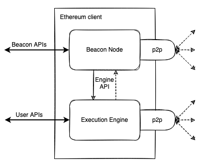

import Tabs from '@theme/Tabs';
import TabItem from '@theme/TabItem';

Prysm is an implementation of the [Ethereum proof-of-stake consensus specification](https://github.com/ethereum/consensus-specs). In this guide, you’ll use Prysm to run a full Ethereum node [<a href='#footnote-X'>TODO</a>] and optionally a validator node. This will let you stake 32 ETH using hardware that you manage [<a href='#footnote-X'>TODO</a>].

This is a beginner-friendly guide. Familiarity with the command line is expected, but otherwise this guide makes no assumptions about your technical skills or prior knowledge.

## Step 1: Identify your goals and system requirements

<table>
    <tr>
        <th>Goal</th>
        <th>Benefits</th>
        <th>Requirements</th>
    </tr>
    <tr>
      <td>Run an execution node + beacon node</td>
      <td>
      Post-merge, this combination will represent an “full Ethereum client”, or a “full node”. Full nodes require both consensus-layer client software and execution-layer client software. <br /><br />
      Running a full node comes with the following benefits: <br /><br />
      <ul> 
        <li>It contributes to the security of Ethereum's ecosystem [<a href='#footnote-X'>TODO</a>].</li>    
        <li>It also lets you access Ethereum’s global state directly without having to trust a third party service [<a href='#footnote-X'>TODO</a>].</li> 
        <li>It lets you run a validator node [<a href='#footnote-X'>TODO</a>]</li> 
      </ul> 
      </td>
      <td>
        <ul> 
          <li><strong>OS</strong>: 64-bit Linux, Mac OS X 10.14+, Windows 10+ 64-bit</li>    
          <li><strong>Memory</strong>: 16GB+ RAM</li> 
          <li><strong>Storage</strong>: SSD with at least 2TB free space</li> 
          <li><strong>Network</strong>: 8 MBit/sec download Internet service</li> 
          <li>TODO</li> 
        </ul> 
      </td>
    </tr>
    <tr>
        <td>Run a validator node</td>
        <td>
        Lets you stake ETH, propose + validate blocks, and earn staking rewards.
        </td>
        <td>
          <ul> 
            <li><strong>A full node</strong>: Execution node + beacon node running locally.</li>    
            <li><strong>32 ETH</strong></li> 
            <li>TODO</li> 
          </ul> 
        </td>
    </tr>
</table>

<div class="admonition admonition-caution alert alert--warning">
  <div class="admonition-content">
      <p>Running an execution node will be required after The Merge. We strongly encourage you to begin running an execution client immediately.</p>
  </div>
</div>

If you can’t run a full node, TODO.

## Step 2: Review best practices

- **Ramp up on the foundations**. If you're new to Ethereum or proof-of-stake, read [A Beginner's Introduction to Prysm and Prysmatic](todo) before proceeding [TODO: importance of understanding how things work at a high-level].
- **Try this guide on testnet first**, *then* mainnet [<a href='#footnote-X'>TODO</a>].
- **Keep things simple**. This guidance assumes all client software will run on a single machine.
- **Review the latest advisories** for both [testnet](https://prater.launchpad.ethereum.org/en/overview) and [mainnet](https://launchpad.ethereum.org/en/).
- **Inbound and outbound firewall rules should be configured** on your machine before proceeding. Keep TCP `8545` closed. Keep TCP and UDP `30303` open so that other execution nodes can connect to your execution node.
- **Review all of our [published security best practices](https://docs.prylabs.network/docs/security-best-practices/)**.
- **Help is available** - reach out to prysm discord, #ethstaker, r/ethstaker, or [invite.gg/ethstaker](http://invite.gg/ethstaker).

turn into checklist

## Step 3: Install and configure an execution client

First, create a directory called `ExecutionLayer` on your SSD [<a href='#footnote-X'>TODO - can be anything</a>].

Next, select an execution client [<a href='#footnote-X'>TODO</a>].

<Tabs groupId="execution-clients" defaultValue="nethermind" values={[
{label: 'Nethermind', value: 'nethermind'},
{label: 'Besu', value: 'besu'},
{label: 'Geth', value: 'geth'}
]}>

  <TabItem value="nethermind">
    <p>Download the latest stable release of Nethermind for your operating system from the <a href='https://downloads.nethermind.io/'>Nethermind downloads page</a>. Run the following command from a terminal window:</p>
    <Tabs groupId="network" defaultValue="mainnet" values={[
        {label: 'Mainnet', value: 'mainnet'},
        {label: 'Testnet', value: 'testnet'}
    ]}>
      <TabItem value="mainnet">
        <pre><code>Nethermind.Runner --config mainnet --JsonRpc.Enabled true</code></pre>
        <ul>
          <li><code>--config mainnet</code> connects to Mainnet.</li>
          <li><code>--JsonRpc.Enabled true</code> exposes an http endpoint that your beacon node can later connect to.</li>
        </ul>
      </TabItem>
      <TabItem value="testnet">
        <pre><code>Nethermind.Runner --config goerli --JsonRpc.Enabled true</code></pre>
        <ul>
          <li><code>--config goerli</code> connects to the Goerli execution-layer testnet.</li>
          <li><code>--JsonRpc.Enabled true</code> exposes an http endpoint that your beacon node can later connect to.</li>
        </ul>
      </TabItem>
    </Tabs>
    <p>Your Nethermind execution node will begin syncing after you issue this command. This should take about two hours to complete. [<a href='#footnote-X'>TODO: Detailed Nethermind installation guidance is available on Nethermind’s documentation portal</a>]</p>
  </TabItem>
  <TabItem value="besu">
    <p>Install the latest stable release of Besu by following the instructions on the <a href='https://besu.hyperledger.org/en/stable/HowTo/Get-Started/Installation-Options/Install-Binaries/'>Besu binary distributions</a> page.</p>
    <Tabs groupId="network" defaultValue="mainnet" values={[
        {label: 'Mainnet', value: 'mainnet'},
        {label: 'Testnet', value: 'testnet'}
    ]}>
      <TabItem value="mainnet">
        <pre><code>besu --network=mainnet --rpc-http-enabled</code></pre>
        <ul>
          <li><code>--network=mainnet</code> connects to Mainnet.</li>
          <li><code>--rpc-http-enabled</code> exposes an http endpoint that your beacon node can later connect to.</li>
        </ul>
      </TabItem>
      <TabItem value="testnet">
        <pre><code>besu --network=goerli --rpc-http-enabled</code></pre>
        <ul>
          <li><code>--network=goerli</code> connects to the Goerli execution-layer testnet.</li>
          <li><code>--rpc-http-enabled</code> exposes an http endpoint that your beacon node can later connect to.</li>
        </ul>
      </TabItem>
    </Tabs>
    <p>Your Besu execution node will begin syncing after you issue this command. This should take about two hours to complete. [<a href='#footnote-X'>TODO: Detailed Besu installation guidance is available on [Besu’s documentation portal](https://besu.hyperledger.org/en/stable/HowTo/Get-Started/Starting-node/).</a>]</p>
  </TabItem>
  <TabItem value="geth">
    <div class="admonition admonition-caution alert alert--warning">
      <div class="admonition-content"><p>Geth is a supermajority execution-layer client. We strongly encourage you to consider using either Nethermind or Besu. [todo]</p></div>
    </div>
    <p>Download and run the latest 64-bit stable release of the <strong>Geth installer</strong> for your operating system from the <a href='https://geth.ethereum.org/downloads/'>geth downloads page</a>. Run the following command from a terminal window:</p>
    <Tabs groupId="network" defaultValue="mainnet" values={[
        {label: 'Mainnet', value: 'mainnet'},
        {label: 'Testnet', value: 'testnet'}
    ]}>
      <TabItem value="mainnet">
        <pre><code>geth --http --datadir .</code></pre>
        <ul>
          <li><code>--http</code> exposes an http endpoint that your beacon node can later connect to.</li>
          <li><code>--datadir .</code> specifies the current directory (ExecutionLayer) as the location for the execution layer database [<a href='#footnote-X'>TODO</a>].</li>
        </ul>
      </TabItem>
      <TabItem value="testnet">
        <pre><code>geth --goerli --http --datadir .</code></pre>
        <ul>
          <li><code>--goerli</code> connects to the Goerli execution-layer testnet.</li>
          <li><code>--http</code> exposes an http endpoint that your beacon node can later connect to.</li>
          <li><code>--datadir .</code> specifies the current directory (ExecutionLayer) as the location for the execution layer database [<a href='#footnote-X'>TODO</a>].</li>
        </ul>
      </TabItem>
    </Tabs>
    <p>Your geth execution node will begin syncing after you issue this command. This should take about two hours to complete. [<a href='#footnote-X'>TODO: Detailed geth installation guidance is available on geth’s documentation portal.</a>]</p>
  </TabItem>
</Tabs>


## Step 4: Install and configure a beacon node using Prysm

You should have an execution node running locally on `http://localhost:8545` before proceeding.

To verify that your execution node is properly configured and running, TODO.

Create a directory called `ConsensusLayer` on your SSD [todo: this can be anything]. Navigate to this directory from your terminal.


<Tabs groupId="network" defaultValue="win" values={[
    {label: 'Windows', value: 'win'},
    {label: 'Linux, MacOS, Arm64', value: 'others'}
]}>
  <TabItem value="win">
    <p>Navigate to your <code>ConsensusLayer</code> directory and run the following three commands from an Administrator command prompt:</p>

```
mkdir prysm && cd prysm
curl https://raw.githubusercontent.com/prysmaticlabs/prysm/master/prysm.bat --output prysm.bat
reg add HKCU\Console /v VirtualTerminalLevel /t REG_DWORD /d 1
```

  <p>This will download the Prysm client and update your registry to enable verbose logging.</p>
  <Tabs groupId="network" defaultValue="mainnet" values={[
      {label: 'Mainnet', value: 'mainnet'},
      {label: 'Testnet', value: 'testnet'}
  ]}>
    <TabItem value="mainnet">
      <p>Use the following command to start a beacon node that connects to your local execution node:</p>
      <pre><code>prysm.bat beacon-chain --http-web3provider=http://localhost:8545</code></pre>
    </TabItem>
    <TabItem value="testnet">
      <p>Download the genesis state from github into your ConsensusLayer directory. Then use the following command to start a beacon node that connects to your local execution node:</p>
      <pre><code>prysm.bat beacon-chain --http-web3provider=http://localhost:8545 --prater --genesis-state=..\genesis.ssz</code></pre>
    </TabItem>
  </Tabs>
  </TabItem>
  <TabItem value="others">
    <p>Navigate to your <code>ConsensusLayer</code> directory and run the following two commands from your terminal:</p>

```
mkdir prysm && cd prysm
curl https://raw.githubusercontent.com/prysmaticlabs/prysm/master/prysm.sh --output prysm.sh && chmod +x prysm.sh
```

  <p>This will download the Prysm client and and make it executable.</p>
  <Tabs groupId="network" defaultValue="mainnet" values={[
      {label: 'Mainnet', value: 'mainnet'},
      {label: 'Testnet', value: 'testnet'}
  ]}>
    <TabItem value="mainnet">
      <p>Use the following command to start a beacon node that connects to your local execution node:</p>
      <pre><code>./prysm.sh beacon-chain --http-web3provider=http://localhost:8545</code></pre>
    </TabItem>
    <TabItem value="testnet">
      <p>Download the genesis state from github into your ConsensusLayer directory. Then use the following command to start a beacon node that connects to your local execution node:</p>
      <pre><code>./prysm.sh beacon-chain --http-web3provider=http://localhost:8545 --prater --genesis-state=../genesis.ssz</code></pre>
    </TabItem>
  </Tabs>
  </TabItem>
</Tabs>

Your beacon node will now begin syncing [todo: explain what happens]. This usually takes a couple days, but it can take longer depending on your network and hardware specs.

Congratulations! You’re now running a <strong>full Ethereum node</strong>. Your full node consists of an <strong>execution node</strong> in Ethereum’s execution layer, and a <strong>beacon node</strong> in Ethereum’s consensus layer:




## Step 5: Install and configure a validator node using Prysm

TODO: This requires 32 ETH to stake

Before proceeding, ensure that your beacon node is fully synchronized by running the following command:

```
curl http://localhost:3500/eth/v1alpha1/node/syncing
```

If you see `{"syncing":false}%`, you’re ready to proceed.

While you’re waiting for your beacon node to synchronize, review the latest Ethereum Foundation validator advisories. Testnet advisories are available on the [Prater Staking Launchpad](https://prater.launchpad.ethereum.org/en/overview). Mainnet advisories are on the [Mainnet Staking Launchpad](https://launchpad.ethereum.org/en/overview).

Next, we’ll create an account with the [Ethereum Staking Deposit CLI](https://github.com/ethereum/staking-deposit-cli). We recommend doing this on a new, airgapped machine if possible [security best practices].

Download the latest stable version of the deposit CLI for your operating system from the [Staking Deposit CLI Releases page](https://github.com/ethereum/staking-deposit-cli/releases).


<Tabs groupId="network" defaultValue="win" values={[
    {label: 'Windows', value: 'win'},
    {label: 'Linux, MacOS, Arm64', value: 'others'}
]}>
  <TabItem value="win">
    <p>Issue the following command from an Administrator command prompt, replacing <code>&lt;YOUR_FOLDER_PATH&gt;</code> with the full path to your <code>ConsensusLayer</code> folder.</p>
    <Tabs groupId="network" defaultValue="mainnet" values={[
        {label: 'Mainnet', value: 'mainnet'},
        {label: 'Testnet', value: 'testnet'}
    ]}>
      <TabItem value="mainnet">
        <pre><code>deposit.exe new-mnemonic --num_validators=1 --mnemonic_language=english --folder=&lt;YOUR_FOLDER_PATH&gt;</code></pre>
      </TabItem>
      <TabItem value="testnet">
        <pre><code>deposit.exe new-mnemonic --num_validators=1 --mnemonic_language=english --chain=prater --folder=&lt;YOUR_FOLDER_PATH&gt;</code></pre>
      </TabItem>
    </Tabs>
    <p>Follow the CLI prompts to generate your keys. This will give you two artifacts:</p>
    <ol>
      <li>A <strong>new mnemonic seed phrase</strong>. This is highly sensitive and should be kept safe, secure, and airgapped.</li>
      <li>A <code>validator_keys</code> folder. This folder will contain two files:
        <ol>
          <li><code>deposit_data-*.json</code> - contains deposit data that you’ll later upload to the Ethereum launchpad.</li>
          <li><code>keystore-m_*.json</code> - contains your public key and ___________.</li>
        </ol>
      </li>
    </ol>
    Issue the following command from your command prompt to import your keystores, replacing <code>&lt;YOUR_FOLDER_PATH&gt;</code> with the full path to your <code>ConsensusLayer</code> folder:<br/>
    <Tabs groupId="network" defaultValue="mainnet" values={[
        {label: 'Mainnet', value: 'mainnet'},
        {label: 'Testnet', value: 'testnet'}
    ]}>
      <TabItem value="mainnet">
        <pre><code>prysm.bat validator accounts import --keys-dir=&lt;YOUR_FOLDER_PATH&gt;</code></pre>
        <p>You’ll be prompted to specify a wallet directory twice. Provide the path to your <code>ConsensusLayer</code> folder for both prompts. You should see <code>Successfully imported 1 accounts, view all of them by running accounts list</code> when your account has been successfully imported into Prysm.</p>
        <p>Next, go to the [Mainnet Launchpad’s deposit data upload page](https://launchpad.ethereum.org/en/upload-deposit-data) and upload your `deposit_data-*.json` file. You’ll be prompted to connect your wallet.</p>
        <p>You can then proceed to deposit 32 ETH into the Mainnet deposit contract via the Launchpad page. Exercise extreme caution throughout this procedure. Finally, head back to your command prompt and run the following command:</p>
        <pre><code>prysm.bat validator</code></pre>
      </TabItem>
      <TabItem value="testnet">
        <pre><code>prysm.bat validator accounts import --keys-dir=&lt;YOUR_FOLDER_PATH&gt; --prater</code></pre>
        <p>You’ll be prompted to specify a wallet directory twice. Provide the path to your <code>ConsensusLayer</code> folder for both prompts. You should see <code>Successfully imported 1 accounts, view all of them by running accounts list</code> when your account has been successfully imported into Prysm.</p>
        <p>Next, go to the [Prater Launchpad’s deposit data upload page](https://prater.launchpad.ethereum.org/en/upload-deposit-data) and upload your `deposit_data-*.json` file. You’ll be prompted to connect your wallet.</p>
        <p>If you need Goeth, head over to one of the following Discord servers:</p>
        <ul>
          <li>r/ethstaker discord</li>
          <li>Prysm discord</li>
        </ul>
        <p>Someone should be able to give you the Goeth you need. You can then proceed to deposit 32 goeth into the Prater testnet’s deposit contract via the Launchpad page. Exercise extreme caution throughout this procedure. Finally, head back to your command prompt and run the following command:</p>
        <pre><code>prysm.bat validator --prater</code></pre>      
      </TabItem>
    </Tabs>
  </TabItem>
  <TabItem value="others">
    <p>Issue the following command from your terminal, replacing <code>&lt;YOUR_FOLDER_PATH&gt;</code> with the full path to your <code>ConsensusLayer</code> folder.</p>
    <Tabs groupId="network" defaultValue="mainnet" values={[
        {label: 'Mainnet', value: 'mainnet'},
        {label: 'Testnet', value: 'testnet'}
    ]}>
      <TabItem value="mainnet">
        <pre><code>./deposit new-mnemonic --num_validators=1 --mnemonic_language=english --folder=&lt;YOUR_FOLDER_PATH&gt;</code></pre>
      </TabItem>
      <TabItem value="testnet">
        <pre><code>./deposit new-mnemonic --num_validators=1 --mnemonic_language=english --chain=prater --folder=&lt;YOUR_FOLDER_PATH&gt;</code></pre>
      </TabItem>
    </Tabs>
    <p>Follow the CLI prompts to generate your keys. This will give you two artifacts:</p>
    <ol>
      <li>A <strong>new mnemonic seed phrase</strong>. This is highly sensitive and should be kept safe, secure, and airgapped.</li>
      <li>A <code>validator_keys</code> folder. This folder will contain two files:
        <ol>
          <li><code>deposit_data-*.json</code> - contains deposit data that you’ll later upload to the Ethereum launchpad.</li>
          <li><code>keystore-m_*.json</code> - contains your public key and ___________.</li>
        </ol>
      </li>
    </ol>
    Issue the following command from your terminal to import your keystores, replacing <code>&lt;YOUR_FOLDER_PATH&gt;</code> with the full path to your <code>ConsensusLayer</code> folder:<br/>
    <Tabs groupId="network" defaultValue="mainnet" values={[
        {label: 'Mainnet', value: 'mainnet'},
        {label: 'Testnet', value: 'testnet'}
    ]}>
      <TabItem value="mainnet">
        <pre><code>./prysm.sh validator accounts import --keys-dir=&lt;YOUR_FOLDER_PATH&gt;</code></pre>
        <p>You’ll be prompted to specify a wallet directory twice. Provide the path to your <code>ConsensusLayer</code> folder for both prompts. You should see <code>Successfully imported 1 accounts, view all of them by running accounts list</code> when your account has been successfully imported into Prysm.</p>
        <p>Next, go to the [Mainnet Launchpad’s deposit data upload page](https://launchpad.ethereum.org/en/upload-deposit-data) and upload your `deposit_data-*.json` file. You’ll be prompted to connect your wallet.</p>
        <p>You can then proceed to deposit 32 ETH into the Mainnet deposit contract via the Launchpad page. Exercise extreme caution throughout this procedure. Finally, head back to your command prompt and run the following command:</p>
        <pre><code>./prysm.sh validator</code></pre>
        Congratulations! You’re now running a <strong>full Ethereum node</strong> and a <strong>validator node</strong> on Mainnet:
      </TabItem>
      <TabItem value="testnet">
        <pre><code>./prysm.sh validator accounts import --keys-dir=&lt;YOUR_FOLDER_PATH&gt; --prater</code></pre>
        <p>You’ll be prompted to specify a wallet directory twice. Provide the path to your <code>ConsensusLayer</code> folder for both prompts. You should see <code>Successfully imported 1 accounts, view all of them by running accounts list</code> when your account has been successfully imported into Prysm.</p>
        <p>Next, go to the [Prater Launchpad’s deposit data upload page](https://prater.launchpad.ethereum.org/en/upload-deposit-data) and upload your `deposit_data-*.json` file. You’ll be prompted to connect your wallet.</p>
        <p>If you need Goeth, head over to one of the following Discord servers:</p>
        <ul>
          <li>r/ethstaker discord</li>
          <li>Prysm discord</li>
        </ul>
        <p>Someone should be able to give you the Goeth you need. You can then proceed to deposit 32 goeth into the Prater testnet’s deposit contract via the Launchpad page. Exercise extreme caution throughout this procedure. Finally, head back to your command prompt and run the following command:</p>
        <pre><code>./prysm.sh validator --prater</code></pre>    
        Congratulations! You’re now running a <strong>full Ethereum node</strong> and a <strong>validator node</strong> on Prater testnet:
      </TabItem>
    </Tabs>
  </TabItem>
</Tabs>


diagram

It will take some time for your validator to become enlisted within the network TODO: use correct terminology - see [this knowledge base](https://kb.beaconcha.in/ethereum-2.0-depositing). 

In the meantime, leave both terminal windows open and running. Once your validator is activated, it will immediately begin proposing and validating blocks. 


## Step 6: Configure monitoring and alerts

TODO

To check on the status of your validator, we recommend checking out the popular block explorers: [beaconcha.in](https://beaconcha.in) by Bitfly and [beacon.etherscan.io](https://beacon.etherscan.io) by the Etherscan team. TODO: how? what address do I use


---------------

<br />


If the eth2 chain has not yet started, the validator will be ready to start proposing blocks and signing votes as soon as the genesis time is reached.


## Advanced Configuration and Key Management

For running an advanced wallet setups, our documentation includes comprehensive guides as to how to use the wallet built into Prysm to recover another wallet, use a remote signing server, and more. You can read more about it [here](https://docs.prylabs.network/docs/wallet/introduction).

**Congratulations, you are now fully participating in Ethereum proof-of-stake**

**Still have questions?** Stop by our [Discord](https://discord.gg/prysmaticlabs) for further assistance!
